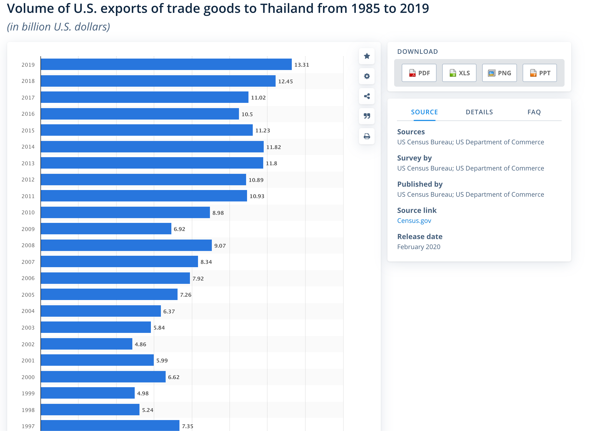
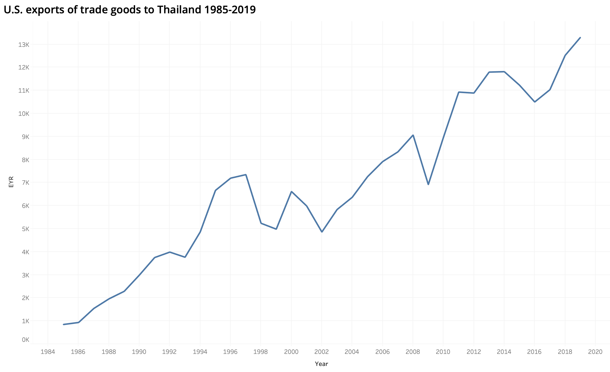

# About me
My name is Maneerat Wongjaroenporn (She,Her). I'm studying MISM-16 months program in Heinz College,Carnegie Mellon University.
I did my bachelor degree in engineering. Prior my master degree, I worked full-time in the consulting firm for both private and government sectors for almost 2 years.

Here are a few interesting things about me....
- I'm Thai. I was born and raised in Bangkok.
- I can speak 4 languages.
- I'm an obvious extrovert XD
- I played Trombone in the orchestra band for 3 years.
- I'm a board game master. My friends ask me every weekend to play with them.

## What I hope to learn (from Datavisualization class)
I'm interested in the methodoloy to present the data profesionally. As I want to be a data scientist, I strongly believe that this skill is very important for communicate the insight that I have found to all stakeholders.

# Career Goal
After graduation, I want to be a data scientist in the company where I can use my technical skills and business experience to find an impactful insight to improve the company performance. I believe that the soft skills like presentation and data visualization are going to enhance my ability to deliver the best outcome to the company.

# Personal Project on Data Scientist
## Personal project on loan performance analysis

https://github.com/maneerat-wong/loan_performance

# Portfolio (Data Visulization)
Here are some visualization that I have done....

## King County COVID-19 Data

## Pension Data
<iframe title="Pension Data" aria-label="chart" id="datawrapper-chart-swas4" src="https://datawrapper.dwcdn.net/swas4/1/" scrolling="no" frameborder="0" style="width: 0; min-width: 100% !important; border: none;" height="400"></iframe>

## General Government Debt Ratio 

### version 1 (Bar Chart)
This is the simple bar chart that we can see the comparison of each country in the specific year.
<iframe src="https://data.oecd.org/chart/65Ff" width="860" height="645" style="border: 0" mozallowfullscreen="true" webkitallowfullscreen="true" allowfullscreen="true"><a href="https://data.oecd.org/chart/65Ff" target="_blank">OECD Chart: General government debt, Total, % of GDP, Annual, 2015</a></iframe>

### version 2 (Grid of Line Chart)
This is Grid Line Chart can provide more information as it show the data of every data in each country. We can see the trend of the particular country but it's hard to compare country by country.

### version 3 (Race Bar Chart)
The race bar chart is designed to give the comparison in each year. I chose top ten country because I want to highlight the top country rather than showing all countries which will make the visualization hard to see. I chose differnt color for different country because it's easier to distinguish and see the comparison.

## Volume of U.S. exports of trade goods to Thailand from 1985 to 2019 (Assignment 4)
I chose this visualization because I'm interested in the relationship between United States commerce and my country. Thailand is a small country but we value the products from United States as a high-end product.

The original visualization : https://www.statista.com/statistics/186559/volume-of-us-exports-of-trade-goods-to-thailand-since-1985/

### Wireframe the solution
The good thing in this graph is its simplicity. I tells us the information of the U.S. exports to Thailand from 1985 to 2019 but it doesn't give me any more information. I can tell that there is an increasing trend each year but the visualization is still hard to compare because the figure is very big. Therefore, I want to recreate it as a line chart so that it's easier to see the trend and any significant insight.

This is the sketch :

After creating the draft, I have asked for the feedback from a number of friend to test my solution.

Feedback 1 : He can tell that this is the graph of U.S. exportation to Thailand but he doesn't understand what is EYR. He can see that there is an increasing trend in the export volumn but he doesn't know what is the main information that he needs to pay attention on. The audience in this graph might be a person with the background in economic or international relation but doesn't need to be an expert in this field. He would like to add more detail on the % change in each year and emphsize the specific time that needs the attention from the audience.

Feedback 2 : He can tell that there is an increase in exports from 1984 to present but he wasn't sure what is EYR. He wasn't sure why the line is quite straight at time and not in other times. He believe that the intended audience is the expert in subject matter. The main thing that he would like to change is adding the units in the axis and explanation or caption for the graph.

Feedback 3: He thinks that it's the graph that shows the exports volume of U.S. to Thailand over time during 1985-2019. It's telling that over time, U.S. trade goods export has a upward increasing trend. Some year has a drop, for example, in 2009, this could happen from the financial crisis in 2008. Overall, the export of U.S. to Thailand has positive slope.3. He's not sure what event happened during 1997-1999 that causes the export to significantly decreased. Again, I have no idea what happended during 2002 that cause the export to drop in that year. He believes that it could be use as a material in global economics class for undergraduate or graduate students. He might indicate the major event that causes the export to decrease on year 1997-1999, 2002, 2008, and 2016.

Feedback 4 : She can tell that a graph is showing the US exports of traded goods to thailand. It shows an increasing trend in the past 36 years, despite some dips in some years. Those dips happened during the recessions. She doesn't know what EYR is. The intended audience is the exporting companies, economists, investors, etc. If she could change the graph, she would explicitly explain the unit of the y-axis and explain why there are some dips or accelerations in some periods. She may compare the US exports to other countries that are relatively in the same rank with thailand to see if there are a similar trends. 

### Final Visualization
From the feedback that I got, I definately have to change the y-axis label. Also, I think adding the information of other country to compare with Thai data is also useful. I chose to compare with the country in south east asia because of the geography and economic situation. I can see that U.S. product is very popular among Thai people. The trend has been increasing over times.

<iframe seamless frameborder="0" src="https://public.tableau.com/views/HW3_16009890710200/Sheet1?:language=en&:display_count=y&:origin=viz_share_link"></iframe>
