# The Idea

## The project outline 
In this project, I want to show people the unique and surprising fact about my country,Thailand. Most people want to go to Thailand because of the tourism but I want to show other side of the country including culture and etc.

There are 5 main parts :

1. Introduction (Make you feel excited and surprised on how popular Thailand is)
2. What can you expect from this country? (Cultural aspect in the country and some interesting myst about Thailand)
3. Is it safe to go? ( Well..I know that Thailand has so many very good and bad reputation about safety. Let's see which one is true.)
4. What do tourist usually do? (Give an a grisp of the feeling of visiting there)
5. Call to action (Book the tour! Mark Thailand as your next destination!)

## A high-level summary of your project.  

What the readers want: 
As a reader, I want more knowledge about this country so that I can travel smartly. 
As a reader, I want to know about Thai culture so that I can talk to other people that I know.

Call for action : 
I can do this by planning a trip to Thailand 
I can do this by learning some Thai food 
I can do this by studying more Thai

# First Draft
This is the first draft of my user story.
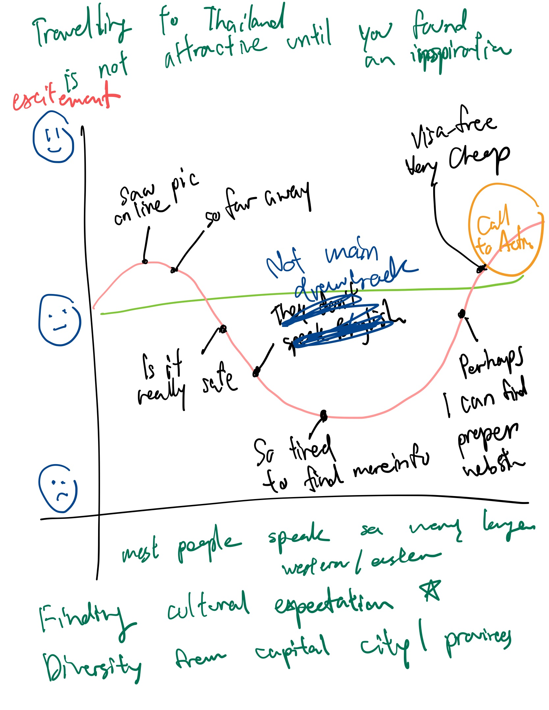

I want to tell the story of someone who is considering to visit Thailand. The first hype emotion happens when the user sees the beautiful photo of Thailand. 
Then, the user has the questions in mind whether it's easy to travel ( Can people in Thailand speak English?, Is it safe to go?, Is it clean? ) Those questions lead to the downfall in the emotion. The turning point is dedunking the myst of the bad story in Thailand. After the user knows that Thailand is very unique and interesting country, the call for action comes.

I had the first discussion with collueges in the class with my first user story. The friend who had been to Thailand said that she wasn't worried about the language when going there. 

These are the 5 main parts:
- Introducing the inspiration of Thai Tourism
- Telling a little bit about economic and culture
- Diversity in the different city
- What to know about travelling to Thailand next time
- Call to action

Tourism Data Set : https://data.world/payapdatasci/thai-tourism/workspace/file?filename=thaitourism2.csv << Showing the Tourism Stats
Global Destination Cities Index : https://newsroom.mastercard.com/wp-content/uploads/2019/09/GDCI-Global-Report-FINAL-1.pdf << Showing the Tourusm Stats
Covid-19 Data Set : https://www.statista.com/statistics/1043366/novel-coronavirus-2019ncov-cases-worldwide-by-country/ << This is an interesting data because Thailand has a very low number of cases and we are coping the situation very well. I though that it's a way to imply that out country is safe.
Crime Rate : https://www.macrotrends.net/countries/THA/thailand/crime-rate-statistics

I planned to create the project on the shorthort with this storyboard.
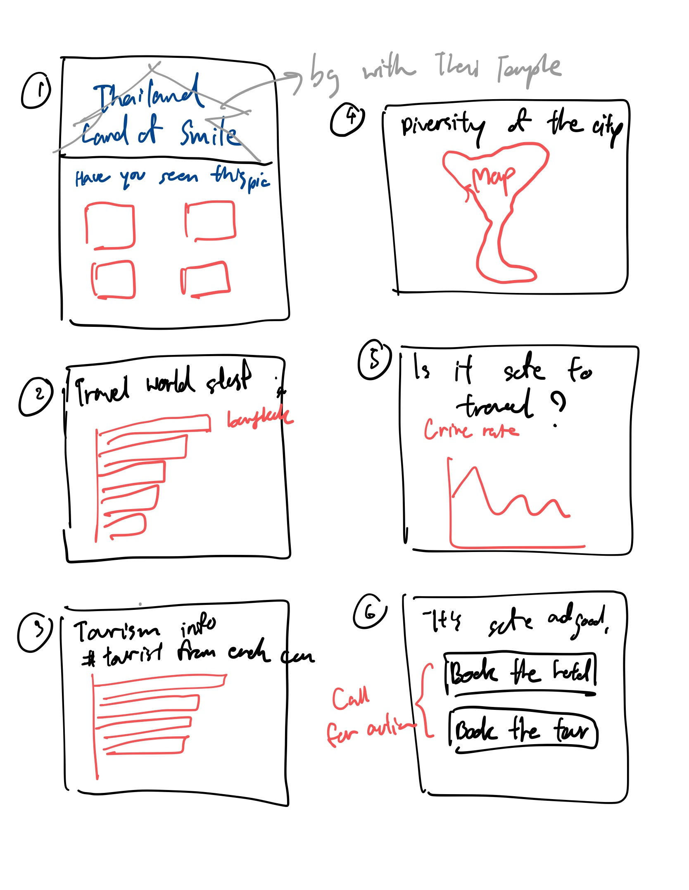

# Second Draft (User Interview + Wireframes)

From the handwritten draft, I started to create the draft on the shorthand.

 ---> 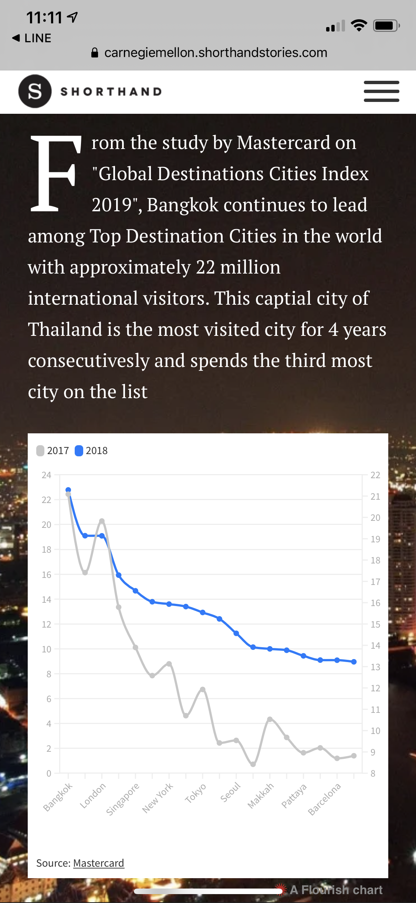 -->  --->   --->  ---> 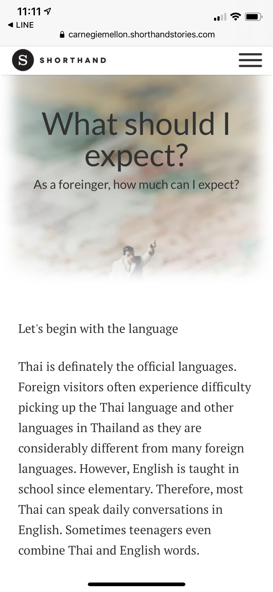 --> 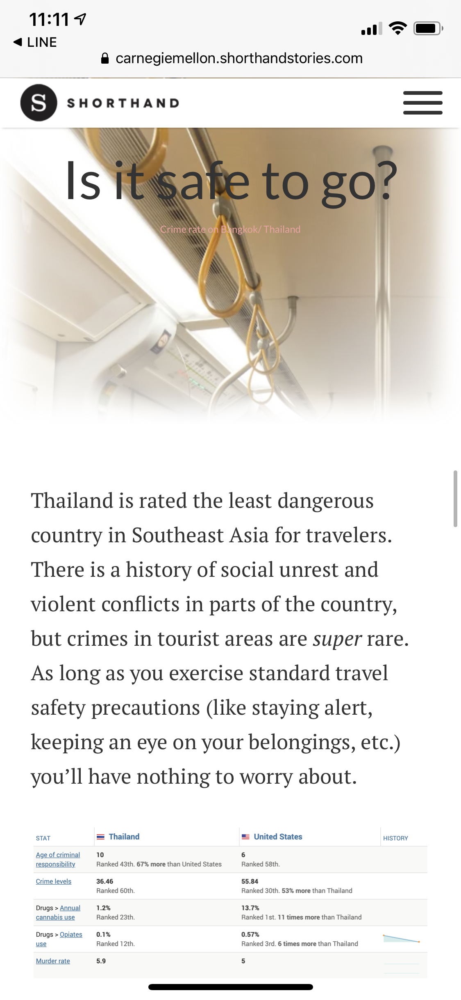 ---> 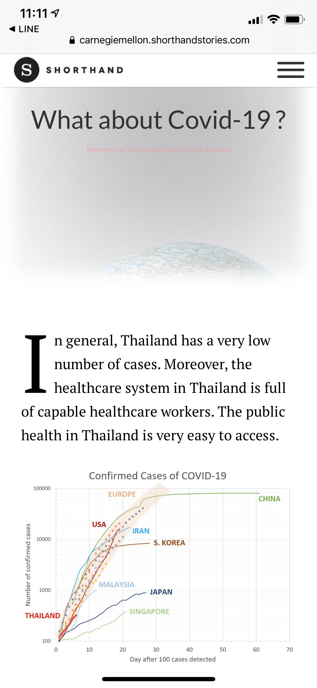  --->  --->  

After that, I interviewed with three friends from different countries.

|                                                           | Thai Male, 30's                                                                                                                                                                                                                                                                                                                                                                                                                                                             | Indonesian Male, 20's                                                                                                                                                       | Chinese Female, 20's                                                                                                                                                                                                                                |
|-----------------------------------------------------------|-----------------------------------------------------------------------------------------------------------------------------------------------------------------------------------------------------------------------------------------------------------------------------------------------------------------------------------------------------------------------------------------------------------------------------------------------------------------------------|-----------------------------------------------------------------------------------------------------------------------------------------------------------------------------|-----------------------------------------------------------------------------------------------------------------------------------------------------------------------------------------------------------------------------------------------------|
| Who is the target audience of this story?                 | I think it's for the tourist who are looking for a place to travel during this situation(COVID-19)                                                                                                                                                                                                                                                                                                                                                                          | Tourist/people who are looking for a vacation                                                                                                                               | People who have a travel plan or people who are interested in travelling to Thailand                                                                                                                                                                |
| What is your first thought after seeing this story?       | Thailand is a very interesting choice for traveling in this suitaion because there are many interesting thing in Bangkok and the number of cases in Thailand is very low. For the map graph,I'm not sure what each dots represent. I'm also not sure the main message that you want to say from the covid-19 cases comparison graph. It seems that you want to say that Thailand has fewer number of cases but the trend seems to be the same as in the USA,S.Korea and EU. | thailand offers lots of interesting places and is still welcoming for tourist destination                                                                                   | The storyline is smooth and complete. It first introduces Thai and reasons why it's popular. Meanwhile what's more interesting is that it mentions issues about safety (crimes, virus ..). It also provides links to book hotels and find guidance. |
| How do you feel after reading about the crime rate stats? | The crime rate is quite high.                                                                                                                                                                                                                                                                                                                                                                                                                                               | I still feel unsafe since your description is for SEA but you don't provide any comparison for SEA. Instead, you compare against US and I feel US is pretty much dangerous. | This visualization might be confusing since I did not find what the horizontal axis represents. Meanwhile in the title it  says from 1997 to 2018, but I only saw data up to 2016.                                                                  |
| Did you find any graphics confusing?                      | Yes. There are many confusing graphs. The first graph on the traveling stats. I think that you want to point out that Bangkok has the highest number among other countries but there is no units on the Y-axis so I'm not sure what is the main message that you want to say.                                                                                                                                                                                               | The "Among all nationalities, American..." graph is too small.                                                                                                              | Mentioned above.                                                                                                                                                                                                                                    |
| What do you think about the flow of the story?            | The flow is interesting. You use the introduction with the inspiration then telling about the cuation or concerns during traveling.                                                                                                                                                                                                                                                                                                                                         | I think it's good. Better add some description of places/food instead of just images.                                                                                       | I love it and it's super fancinating!! Make people want to read and explore the website!!                                                                                                                                                           |
| What would you change about this story?                   | Mostly the data vizualization                                                                                                                                                                                                                                                                                                                                                                                                                                               | If you have data for 2019 for first graph it will be better.                                                                                                                | Maybe you can add some traditional Thai culture introduction (not only on food or weather) like special festivals or celebrations!                                                                                                                  |

| Questions                                                 | Findings                                                                                                                                                                                                                        | Plan on changing                                                             |
|-----------------------------------------------------------|---------------------------------------------------------------------------------------------------------------------------------------------------------------------------------------------------------------------------------|------------------------------------------------------------------------------|
| What is your first thought after seeing this story?       | Users understand that Thailand is still welcoming for traveling and it's a really interesting destination to go.                                                                                                                | Giving more description on food/places                                       |
| How do you feel after reading about the crime rate stats? | Users don't feel that it's safe to travel to Thailand because I compare it with USA which is the country with a high reputation of crime rate. Therefore, the message that Thailand is safe to travel is not persuasive at all. | Finding other comparison. For example, compare with the country in SEA       |
| Is anything surprising or confusing?                      | Users were confused on the map graph representing the distribution of the tourists. Also, the frist graph doesn't really tell users anything that Thailand is doing really well in tourism industry.                            | Revise the graph type of the tourist distribution graph and the first graph. |

I have a chance to present to firends in the class again on the modified version about the interview.

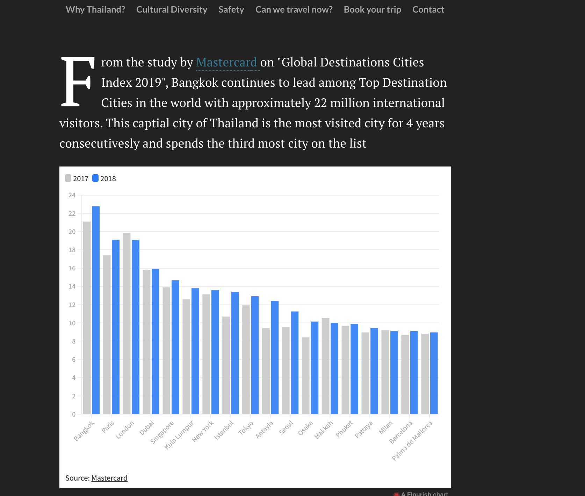
I changed the line graph to the bar chart so that it's easier to see the comparison. I chose the blue color on the 2018 bar to highlight the latest situation.
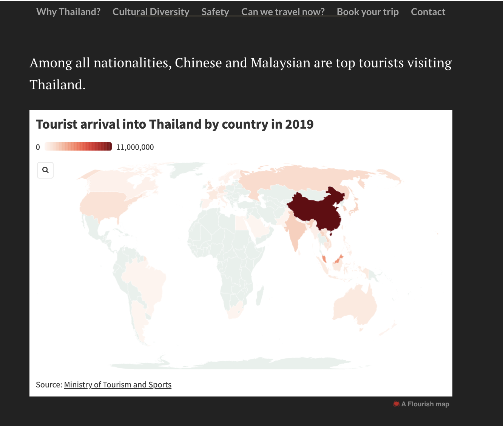
I chose the map to see show the distribution of the travellers across different countries.

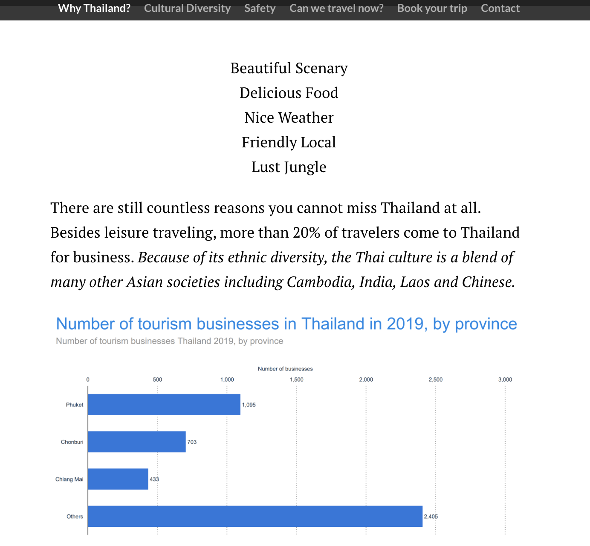
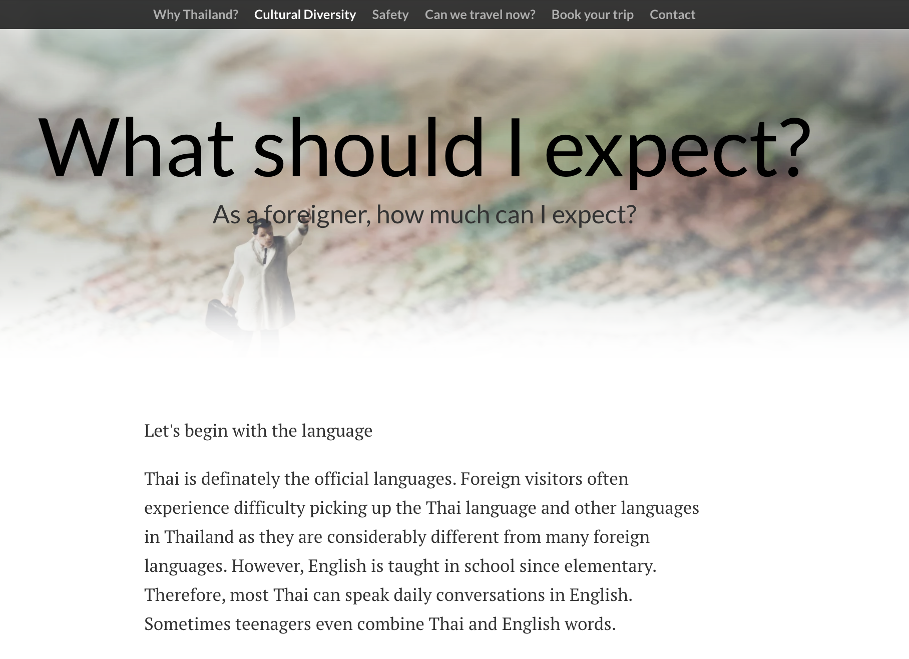
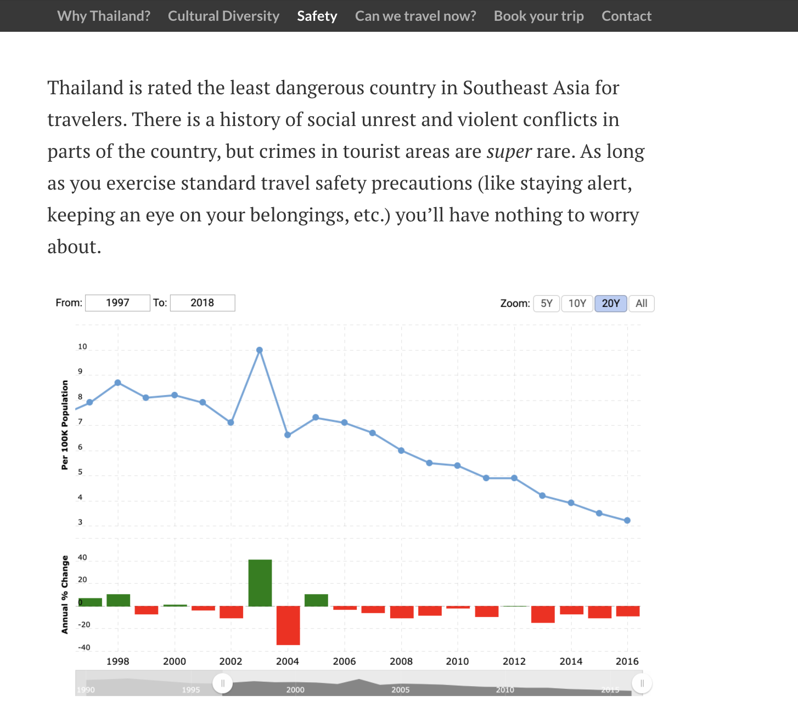
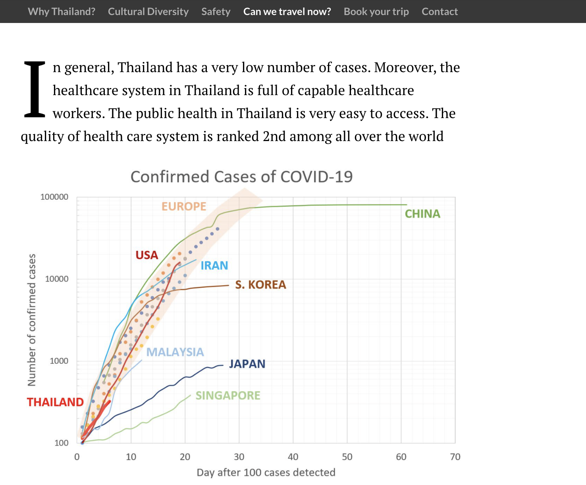
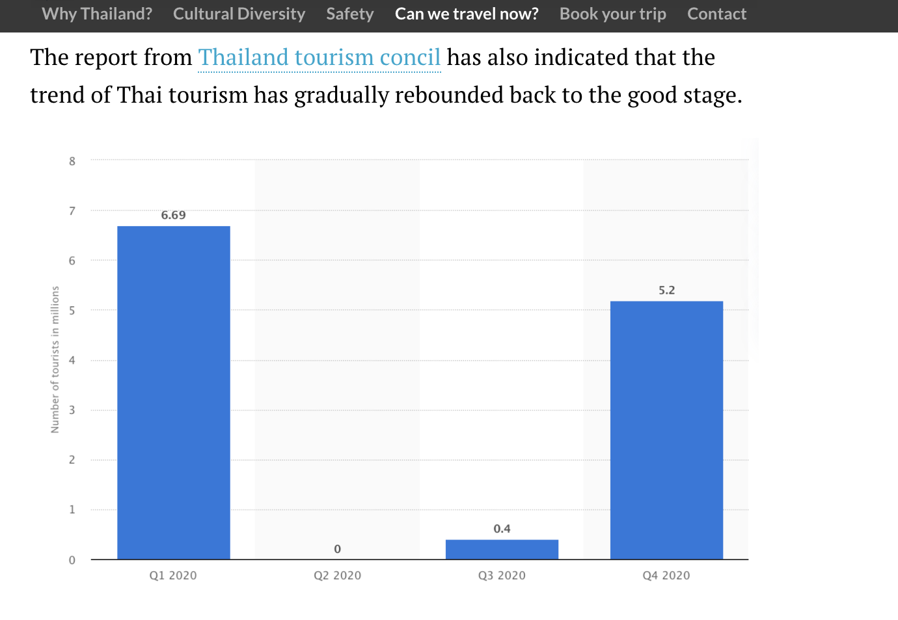
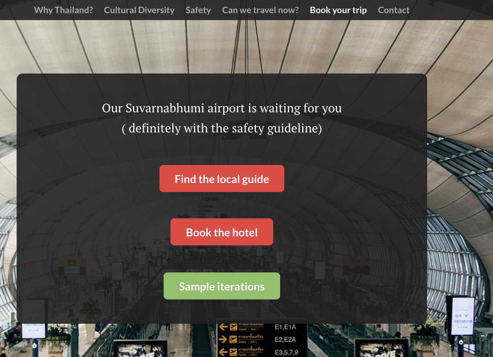

Surprisingly, most friends suggested me to remove the covid section because it's not persuasive enough and risky to say that Thailand is safe to go given the current situation. So I have to redesign those part again.

# Final Data Story

Final Presentation : https://carnegiemellon.shorthandstories.com/blending-into-the-land-of-smile/index.html

Datasource on the website
- Perception of foreigner vs Thai : https://www.researchgate.net/publication/247506743_Thailand_as_a_Tourist_Destination_Perceptions_of_International_Visitors_and_Thai_Residents
- Quality of Life indicator :  https://www.numbeo.com/quality-of-life/region_rankings.jsp?title=2020-mid&region=142
- Global Destination Cities Index : https://newsroom.mastercard.com/wp-content/uploads/2019/09/GDCI-Global-Report-FINAL-1.pdf
- Most inbound tourists by country : https://data.world/payapdatasci/thai-tourism/workspace/file?filename=thaitourism2.csv
