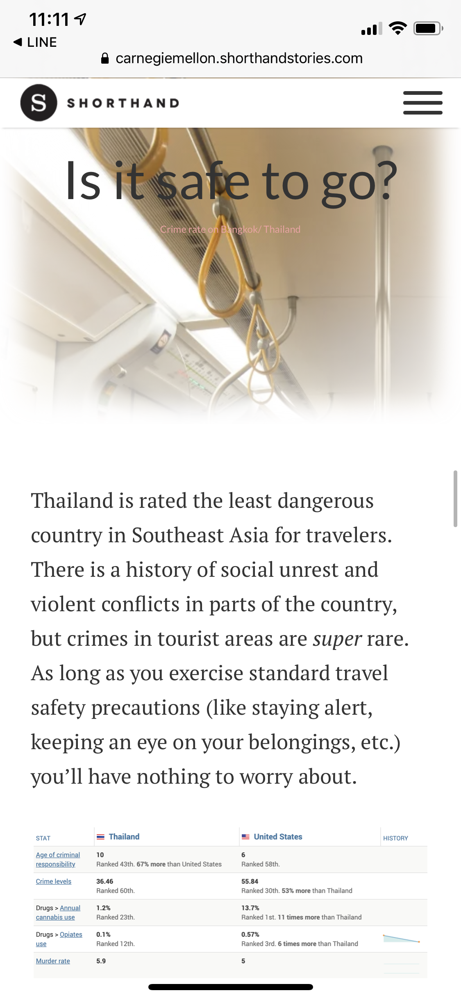

# Recap Project Overview
In this project, I want to show people the unique and surprising fact about my country,Thailand.
Most people want to go to Thailand because of the tourism but I want to show other side of the country including culture and etc.

# Story Board
I do my storyboard on Shorthand because I will do my final presentation on the Shorthand. Therefore,it's easier for the user to see the overall flow as well.

 --->  -->  --->   --->  --->  -->  --->   --->  --->  

# User interview

|                                                           | Thai Male, 30's                                                                                                                                                                                                                                                                                                                                                                                                                                                             | Indonesian Male, 20's | Chinese Female, 20's |   |
|-----------------------------------------------------------|-----------------------------------------------------------------------------------------------------------------------------------------------------------------------------------------------------------------------------------------------------------------------------------------------------------------------------------------------------------------------------------------------------------------------------------------------------------------------------|-----------------------|----------------------|---|
| Who is the target audience of this story?                 | I think it's for the tourist who are looking for a place to travel during this situation(COVID-19)                                                                                                                                                                                                                                                                                                                                                                          | 0.631578              | 0.730769             |   |
| What is your first thought after seeing this story?       | Thailand is a very interesting choice for traveling in this suitaion because there are many interesting thing in Bangkok and the number of cases in Thailand is very low. For the map graph,I'm not sure what each dots represent. I'm also not sure the main message that you want to say from the covid-19 cases comparison graph. It seems that you want to say that Thailand has fewer number of cases but the trend seems to be the same as in the USA,S.Korea and EU. | 0.439560              | 0.737977             |   |
| How do you feel after reading about the crime rate stats? | The crime rate is quite high.                                                                                                                                                                                                                                                                                                                                                                                                                                               | 0.266666              | 0.797198             |   |
| Did you find any graphics confusing?                      | Yes. There are many confusing graphs. The first graph on the traveling stats. I think that you want to point out that Bangkok has the highest number among other countries but there is no units on the Y-axis so I'm not sure what is the main message that you want to say.                                                                                                                                                                                               |                       |                      |   |
| What do you think about the flow of the story?            | The flow is interesting. You use the introduction with the inspiration then telling about the cuation or concerns during traveling.                                                                                                                                                                                                                                                                                                                                         |                       |                      |   |
| What would you change about this story?                   | Mostly the data vizualization                                                                                                                                                                                                                                                                                                                                                                                                                                               |                       |                      |   |

<ins>Overall feedback</ins>
I think that I have to change the graph type and make it easier to understand

Changing Graph:

# Finding

# Next Step

This is the latest version of my draft : https://carnegiemellon.shorthandstories.com/blend-into-thailand/index.html
I will mainly work on the vizualization to make sure that I've delivered the persuasive and compelling message to my user.
